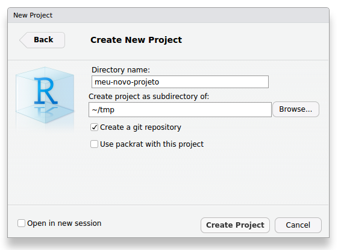
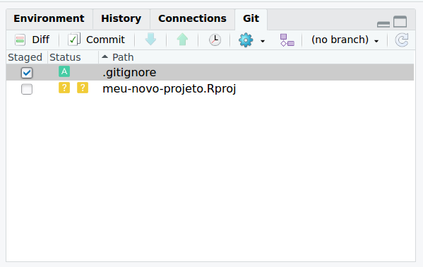
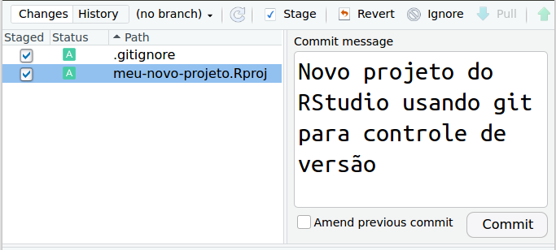
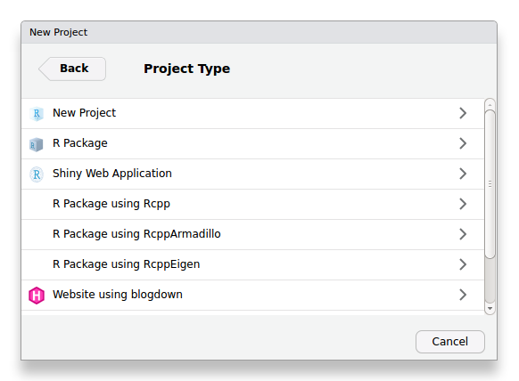
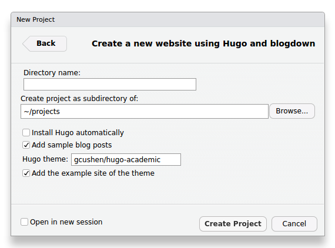

<!-- # PARTE II -- INFRAESTRUTURA TECNOLÓGICA {-} -->

<!-- # Hardware -->

<!-- # Programas de Computador -->

# Gestão de Dados e Código Fonte

**Atenção!** Este capítulo está em fase de *desenvolvimento*. Visite a [página do projeto][issues] se tiver 
alguma sugestão, dúvida ou estiver disposto a colaborar. Sua opinião/ajuda é muito importante!

## Introdução

Um importante passo consiste na criação do nosso diretório de trabalho. Para isso, acesse seu gerenciador
de diretórios e crie a seguinte estrutura de diretórios em seu local favorito de trabalho:

```bash
projeto
|- code/             # código fonte
|
|- data/             # dados usados no projeto
|  |- r/             # dados no formato *.RDA
|  |- raster/        # dados matriciais (GeoTIFF)
|  |- vector/        # dados vetoriais (SHP)
|
|- docs/             # documentos do projeto
|
|- res/              # resultados do projeto
|  |- fig/           # figuras (PNG, TIFF, JPEG, SVG)
|  |- tab/           # tabelas (CSV, TSV)
|
|- README.md         # descrição do projeto
```

Note que o diretório de trabalho do projeto contém quatro subdiretórios: `code`, `data`, `docs` e `res`. O
primeiro deles, `code`, serve para armazenarmos os arquivos contendo código de programação em qualquer 
linguagem. Por exemplo, código em R, Python, SQL, LaTeX e assim por diante. São os _scripts_ com código de programação que usamos no projeto.

O segundo subdiretório é utilizado para armazenarmos os dados usados no projeto. Nesse exemplo, são três os
tipos de dados considerados, cada tipo dedicado a um subsubdiretório específico. No subsubdiretório `raster` 
ficam armazenados os dados matriciais, também conhecidos como dados no formato _raster_ ou _grid_. Por exemplo,
dados de covariáveis ambientais como modelos digitais de elevação e imagens de satélite e o resultado de
predições espaciais do solo. Já no subsubdiretório `vector` ficam armazenados os dados vetoriais, ou seja,
aqueles cuja forma de representação espacial pode ser a de pontos, linhas e polígonos. Isso inclui os dados do
solo e dos limites da área de estudo. Por fim, o subsubdiretório `r` serve para armazenar dados diversos
produzidos durante a análise e processamento dos dados R e que são salvos em disco usando o formato `RDA`.

O terceiro subdiretório do diretório de trabalho do projeto, denominado `docs`, é usado para armazenar os
arquivos usados para redigir os documentos resultantes do projeto.

Por fim, o diretório `res` armazena os resultados do projeto exportados na forma de figuras -- `fig` -- e
tabelas -- `tab`.

No RStudio, acesse

    Arquivo > Novo projeto > Diretório existente

e navegue até o diretório recém criado -- `projeto`. Pressione `Criar projeto`. Pronto! Toda a estrutura de
diretórios recém criada aparecerá no painel direito inferior do RStudio. Agora crie um novo arquivo do R e
salve-o no diretório `bigdata > code > R`. Será nesse arquivo que você organizará o código em R usado para o
processamento dos dados. A criação de um projeto no RStudio facilita a organização dos dados.
Sempre que uma rotina de análises for desenvolvida no R é preciso definir o diretório de trabalho. O diretório 
de trabalho constitui a pasta em que estão localizados os arquivos contendo os dados a serem analisados. Além 
disso, é no diretório de trabalho que o R salva o histórico de trabalho contendo todas as operações realizadas.

Inicie o QGIS e acesse

    Projeto > Novo > Salvar como

e navegue até o diretório `projeto`. Nomeie o projeto como `projeto`. Assim como para o
RStudio, a criação de um projeto no QGIS facilita a organização dos dados.

## Bases de Dados do Solo

### Perfis do Solo

* CENA-USP: Digital soil properties database of the Amazon part from the RADAMBRASIL project
    + ftp://fapespclima.ccst.inpe.br/lba/ornlworking/carbon_dynamics/CD/CD-208/CD208_RADAMBRASIL_Soils/
* Esalq-USP: A national soil profile database for Brazil available to international scientists
    + http://www.esalq.usp.br/gerd/
* EMBRAPA: Sistema de Informação de Solos Brasileiros
    + https://www.bdsolos.cnptia.embrapa.br/consulta_publica.html
* ISRIC: World Soil Information Service (WoSIS)
    + http://www.isric.org/data/wosis
* NASA: Large-Scale Biosphere-Atmosphere Experiment in Amazonia
    + https://daac.ornl.gov/LBA/lba.shtml

### Mapas do Solo 

* EMBRAPA: GeoPortal Digital
  + http://mapoteca.cnps.embrapa.br/
* ISRIC: SoilGrids
  + https://soilgrids.org/

## Gerenciamento de Código Fonte

### git

O controle de versão é uma prática de fundamental importância para o gerenciamento ao longo do tempo de arquivos em geral, dentre eles arquivos contendo código fonte. Um sistema de controle de versão registra todas as mudança feitas no código fonte. Assim, quando cometemos algum erro ou desenvolvemos o código fonte em uma direção que mais tarde se mostra equivocada, podemos olhar para as versões anteriores do código fonte até encontrarmos o ponto em que erramos ou o momento no qual tomamos aquela direção equivocada. Basta então recuperar aquela versão do código fonte e continuar o seu desenvolvimento dali em diante.

A estratégia de controle de versão mais comumente usada consiste em manter uma estrutura de arquivos mais ou menos com a seguinte:

    meu-novo-projeto/
    |- code/
    |  |- script01.R
    |  |- script01-modificado.R
    |  |- script02.R
    |  |- script02-revisado.R
    |  |- script02-revisado-novo.R
    |  |- script-final.R
    |  |- script-final-final.R

Segundo a estratégia acima, cada arquivo é nomeado de acordo com o estágio de desenvolvimento e fazendo uma referência generalista ao tipo de alteração feita. Isso pode ser eficiente quando fazemos poucas alterações ou então alterações pouco significativas. Contudo, à medida que aumenta a complexidade de nosso projeto, maior será o número de edições no código fonte e, também, maior será a complexidade delas. Felizmente existem alternativas bastante mais eficientes do que aquela mostrada acima. Na verdade, um bom sistema de controle de versão dará conta do registro e organização das diferentes versões do código fonte de maneira completamente automática.

Um dos sistemas mais populares de gerenciamento e controle de versão de código fonte é o [git][git]. Comparado aos outros sistemas de controle de versão, uma das grandes vantagens do git é o fato de ser de fácil instalação e poder ser utilizado localmente, sem necessidade de conexão permanente a um servidor remoto. Isso é possível porque o git  realiza todas as operações de gerenciamento do código fonte localmente. Basta submeter (em inglês, *commit*) ao git toda e qualquer edição importante, associando à ela uma mensagem descritiva. Além da importância para o uso pessoal, essa funcionalidade também é muito importante quando temos acesso limitado ou intermitente ao [repositório remoto][github] onde publicamos e compartilhamos o código fonte (por exemplo, por limitada conexão à Internet).

[git]: https://git-scm.com/
[github]: https://github.com/

Outra importante funcionalidade do git -- comparado aos demais sistemas de controle de versão -- é a capacidade de gerenciar diferentes "ramos" (em inglês, *branches*) de desenvolvimento do código fonte. Assim, há sempre um ramo principal, com a versão mais estável do código fonte, e ramos secundários com os quais podemos fazer testes diversos, tudo isso sem tocar na versão estável do código fonte. Caso os resultados de um ramo de desenvolvimento do código fonte se mostrarem interessantes e julgarmos que vale a pena adicioná-los à versão estável do código fonte, basta fazer a fusão (em inglês, *merge*) dos dois ramos -- ou simplesmente deletar o ramo de teste caso seus resultados se mostrem inúteis. Na prática, isso elimina a necessidade de criação de diferentes arquivos, tanto quando trabalhamos sozinhos, como quando trabalhamos em grupo.

Passemos então à instalação e uso do git!

Para verificar se você já tem o git instalado em seu computador, acesse o Terminal -- painel esquerdo inferior do RStudio -- e emita as linhas de comando abaixo conforme o seu sistema operacional:

```{bash, eval=FALSE}
# Verificação da instalação do git
which git # Linux & Mac
where git # Windows
git --version
```

Se o git estiver instalado, o primeiro comando (`which git`, em Linux e Mac, ou `where git`, em Windows) deverá retornar o caminho para o diretório onde os arquivos do git estão localizados -- por exemplo, `/usr/bin/git` --, enquanto o segundo comando mostra a versão do git que está instalada -- por exemplo, `git version 2.7.4`. Caso você não tenha o git instalado em seu computador, vá até o endereço https://git-scm.com/downloads e descarregue o instalador e estude as diretrizes de instalação para o seu sistema operacional.

Depois de instalado o git, e antes do seu primeiro uso, é preciso configurar duas variáveis globais. Trata-se
de informar seu nome e endereço de e-mail para o git. Isso é necessário porque o git registra esses dados à
cada edição submetida ao controle de versão. Apesar da pequena utilidade quando trabalhamos sozinhos, essa
prática é da maior importância quando duas ou mais pessoas colaboram na edição do código fonte, permitindo
identificar quem fez cada alteração e quantas alterações foram feitas por cada colaborador. Para configurar o
seu nome e endereço de e-mail no git, acesse o Terminal, localizado ao lado do Console do R, e emita as duas 
linhas de comando abaixo substituindo com seus dados os campos pertinentes:

```{bash, eval=FALSE}
# Configuração do git
git config --global user.name 'Escreva Seu Nome aqui'
git config --global user.email 'escrevaseu@email.aqui'
```

A maneira mais fácil de utilizar o git para o gerenciamento e controle de versão do código fonte -- e demais dados e documentos -- que produzimos em nossos projetos é via RStudio. Para isso, ao criar um novo projeto no RStudio usando um novo diretório (`Files > New Project > New Directory > New Project`), devemos habilitar a opção `Create a git repository`:

```{r rstudio-novo-projeto-git, echo=FALSE, fig.cap="Novo projeto do RStudio usando git para controle de versão.", out.width='50%', fig.align='center'}

```

O diretório do novo projeto do RStudio deverá conter uma estrutura com a mostrada abaixo: (Pode ser preciso habilitar a visualização de arquivos ocultos em seu gerenciador de arquivos 😉)

    meu-novo-projeto/
    |- .git/
    |- .Rproj.user/
    |- meu-novo-projeto.Rproj
    |- .gitignore

Tando o subdiretório `.Rproj.user` como o arquivo `meu-novo-projeto.Rproj` já foram descritos anteriormente. O que temos de novidade aqui são o subdiretório `.git` e o arquivo `.gitignore`. O subdiretório `.git` consiste no repositório local onde as edições submetidas ao git são registradas. Já o arquivo `.gitignore` serve para identificar os arquivos e subdiretórios que devem ser, como o próprio nome sugere, ignorados pelo git. É o caso, por exemplo, de um subdiretório temporário criado para armazenar produtos do projeto que podem mudar a cada instante e serem descartados a qualquer momento.

Agora, no Terminal, emita o comando `git status` para acessar as informações sobre o estado atual do git:

```{bash, eval=FALSE}
# Verificação do estado atual do git
git status
```

O resultado impresso no terminal deve ser aproximadamente o seguinte:

    On branch master
    
    Initial commit
    
    Untracked files:
      (use "git add <file>..." to include in what will be committed)
    
            .gitignore
            meu-novo-projeto.Rproj

    nothing added to commit but untracked files present (use "git add" to track)

A primeira informação é de que estamos operando no ramo `master` do git. Ademais, temos a informação de que existem dois arquivos não monitorados pelo git: `.gitignore` e `meu-novo-projeto.Rproj`. Para iniciar o monitoramento desses arquivos, acessamos a aba `Git` no painel superior direito to RStudio e habilitamos as caixas sob o item `Staged`, o que fará o símbolo sob o item `Status` passar de um sinal de interrogoção amarelo para um `A` verde (adicionar, do inglês *add*).

```{r rstudio-git-add, echo=FALSE, fig.cap="Adicionando arquivos ao monitoramento do git.", out.width='50%', fig.align='center'}

```

Em seguida acessamos o item `Commit` e, na janela que abrir, inserirmos uma mensagem (`Commit message`) descrevendo o tipo de edição feita no projeto. Nesse caso, a edição consistiu na criação de um novo projeto do RStudio usando git para controle de versão (Figura \@ref(fig:rstudio-git-commit)). Feito isso basta pressionar o botão `Commit`.

```{r rstudio-git-commit, echo=FALSE, fig.cap="Submissão de edição ao git.", out.width='50%', fig.align='center'}

```

Para criar um novo ramo usamos o comando `git branch`:

    git branch teste

O comando acima criou um ramo chamado `teste`. Agora precisamos informar o git que as próximas edições feita no código fonte sejam registradas no ramo `teste`. Para mudarmos para o novo ramo usamos o comando `git checkout`:

    git checkout teste

Ou, alternativamente, podemos usar a opção `-b` com o comando `git checkout` para criar e mudar para o novo ramo de uma só vez:

    git checkout -b teste

Se emitirmos novamente o comando `git status`, veremos que estamos, de fato, trabalhando no ramo `teste`. A partir de agora todas as edições são registradas no ramo `teste`. Suponha, por exemplo, que dentre as edições feitas está a criação de um arquivo chamado `teste.txt`. Nesse caso, precisamos adicionar o novo arquivo ao índice do git. Para isso usamo o comando `git add`: 

    git add teste.txt

Também precisamos registrar no git uma mensagem que descreva minimamente nossa ação. Para isso usamos o comando `git commit`:

    git commit -m 'Criação do novo arquivo teste.txt contendo informações sobre o teste'

Enquanto fazemos essas edições no ramo `teste`, o ramo `master` continua exatamente como o deixamos quando criamos e mudamos para o ramo `teste`. Suponha que agora queremos fundir as edições feitas no ramo `teste` com aquelas feitas no ramo `master`. Para isso precisaos primeiro mudar para o ramo `master`:

    git checkout master

Para fundir o ramo `teste` com o ramo `master` usamos o comando `git merge`:

    git merge teste

Caso tenhamos terminado o desenvolvimento no ramo `teste` e não voltaremos mais a usar aquele ramos, podemos deletá-lo. Para isso usamos a opção `-d` com o comando `git branch`:

    git branch -d teste

### GitHub

O [GitHub][github] é uma das plataformas mais populares para hospedagem de código fonte, sobretudo entre os usuários e desenvolvedores de pacotes para o R.

[github]: https://github.com/

Acesse a página do GitHub no endereço abaixo para criar sua conta:

* https://github.com/

## Documentação e Publicação

### Programação letrada

Linguagem de marcação [Markdown do R](http://rmarkdown.rstudio.com/)

[Cadernos de anotações](http://rmarkdown.rstudio.com/r_notebooks.html). 

### Plataformas de publicação

O [Hugo][hugo], um programa de computador gratuito e de código aberto, é um dos geradores de páginas estáticas da Internet mais populares. Um gerador de páginas estáticas consiste num programa que recebe arquivos de texto plano (Markdown) como entrada e os processa de maneira a produzir arquivos no formato HTML. Esses arquivos no formato HTML finalmente vão compor o conteúdo essencial da página da Internet. Qualquer pessoa que acessar uma página estática receberá, em seu computador, exatamente o mesmo conteúdo. Isso é completamente diferente das páginas com conteúdo dinâmico (Figure \@ref(fig:ufsm-page)), as quais podem enviar conteúdos diferentes para as pessoas que a estiverem acessando dependendo de condições específicas. Por exemplo, uma página que exige o cadastro do visitante enviará conteúdo relacionado àquele visitante. Para que isso ocorra, as páginas dinâmicas dependem de uma base de dados e uma linguagem como PHP no servidor para realizar algum processamento antes de enviar o conteúdo da página ao seu visitante. Numa página estática, o conteúdo não fica armazenado em uma base de dados, e sim em arquivos HTML prontos para servir armazenados num servidor qualquer. Assim, as páginas estáticas costumam ser mais rápidas em responder às ações dos visitantes. Elas também são mais fáceis de implementar e manter, uma vez que não dependem de servidores especializados ou a instalação de programas específicos para gerenciamento de conteúdo.

[hugo]: https://gohugo.io/

```{r ufsm-page, echo=FALSE, fig.cap="Página dinâmica da Universidade Federal de Santa Maria.", out.width='80%', fig.align='center'}
knitr::include_url("http://site.ufsm.br/")
```

Existem inúmeros geradores de páginas estáticas da Internet. O Hugo se destaca entre eles por ser de fácil instalação e conter nenhuma ou pouquíssimas dependências (dependendo do sistema operacional). O Hugo também é bastante rápido na geração das páginas e relativamente fácil de configurar se comparado aos demais geradores de páginas estáticas existentes. Além disso, o Hugo possui uma comunidade de usuários bastante ativa, o que facilita as coisas quando precisamos resolver alguma dúvida. Essa atividade reflete no número de [temas][tema-hugo] -- coleção de arquivos de modelos e recursos opcionais (CSS e JavaScript) que definem o aspecto visual da página quando publicada -- disponíveis para instalação.

[tema-hugo]: https://themes.gohugo.io

Visite o endereço abaixo para ver as instruções sobre como instalar a última versão do Hugo:

* https://gohugo.io/getting-started/installing/

Ou, alternativamente, descarregue o instalador para o seu OS do seguinte endereço:

* https://github.com/gohugoio/hugo/releases

A principal deficiência do Hugo -- para usuários do R -- é a falta de suporte para a implementação do Markdown para o R. Isso significa que, na implementação nativa do Hugo, não é nada fácil gerar resultados (figuras, tabelas) usando código do R. Além disso, o Hugo não usa o [Pandoc][pandoc] como motor de conversão de Markdown em HTML. Foi exatamente para sanar essas duas deficiências que o engenheiro de *software* do RStudio [Yihui Xie][yihui-xie] criou o pacote do R [blogdown][blogdown].

[pandoc]: http://pandoc.org/
[blogdown]: https://bookdown.org/yihui/blogdown/
[yihui-xie]: https://yihui.name

```{r, eval=FALSE}
# Instalação da última versão do pacote blogdown e dependências
devtools::install_github("rstudio/blogdown", dependencies = TRUE)
```

Projetos de construção de páginas da Internet usando Hugo e blogdown podem ser facilmente gerenciados usando o RStudio. Para criar um projeto, vá até `File > new Project > New Directory` e escolha `Website using blogdown` (Figura \@ref(fig:website-using-blogdown)).

```{r website-using-blogdown, echo=FALSE, fig.cap='Criação de novo projeto de página da Internet usando blogdown no RStudio.', out.width='50%', fig.align='center'}

```

A próxima caixa de diálogo traz opções para definir o nome do novo diretório e a sua localização no sistema de arquivos de seu computador (Figura \@ref(fig:diretorio-tema-blogdown)). Como você já instalou o Hugo, desabilite a opção `Install Hugo automatically`. Escolha o [tema do Hugo][tema-hugo] indicando o nome do respectivo repositório no GitHub. (Recomendo usar o tema [acadêmico][tema-academico] `gcushen/hugo-academic` 😃)

```{r diretorio-tema-blogdown, echo=FALSE, fig.cap='Escolha do diretório do projeto e tema da página da Internet usando blogdown no RStudio.', out.width='50%', fig.align='center'}

```

[tema-academico]: https://themes.gohugo.io/academic/
